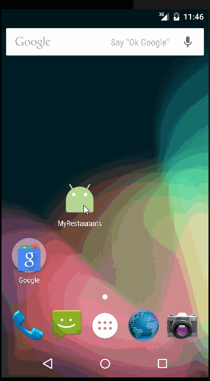

# MyRestaurants

MyRestaurants is an android app that uses device's location information to fetch nearby restaurants via Yelp API and get map information of restaurants.

Submitted by: Zekun Wang

The following **required** functionality is completed:

* [x] User can **communicate with Yelp via Yelp API** and get nearby restaurants
* [x] User can **tap a restaurant in the list and bring up an new screen to show it on map**.

The following **optional** features are implemented:

* [x] Request location information from device
* [x] Improve style of the restaurants in the list [using a custom adapter]
* [x] Use fragment instead of new Activity to show list of restaurants

The following **additional** features are implemented:
* [x] Add support to show all restaurants in the same map

Here's a walkthrough of implemented user stories:

GIF created with [LiceCap](http://www.cockos.com/licecap/).

Challenges encountered while building the app:

1. Get location information from device
2. Implement Google map functionalities.
3. Analysis of response data from Yelp
